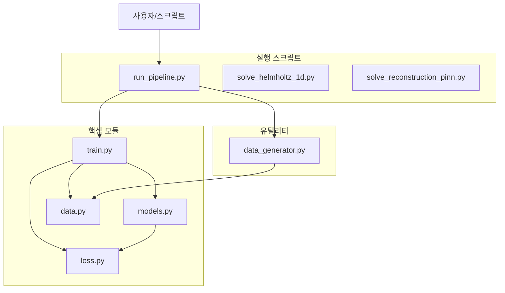
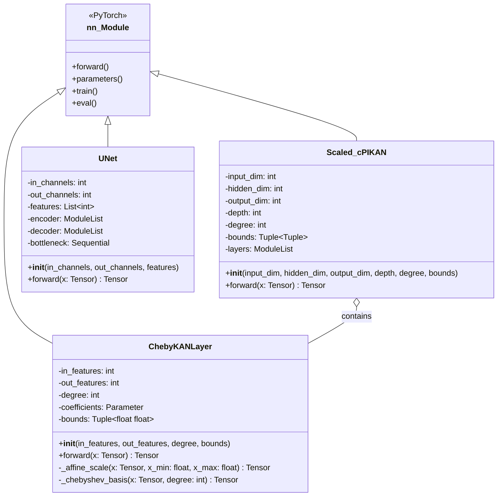
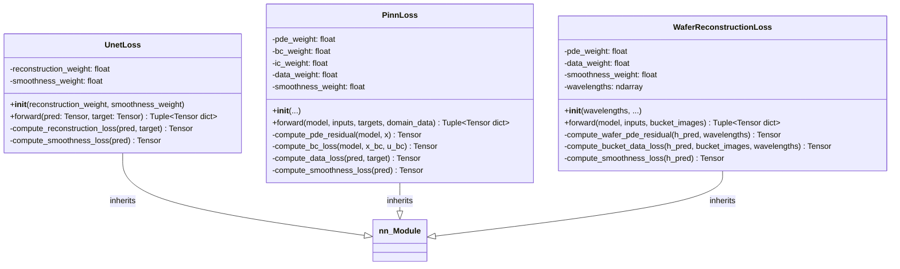
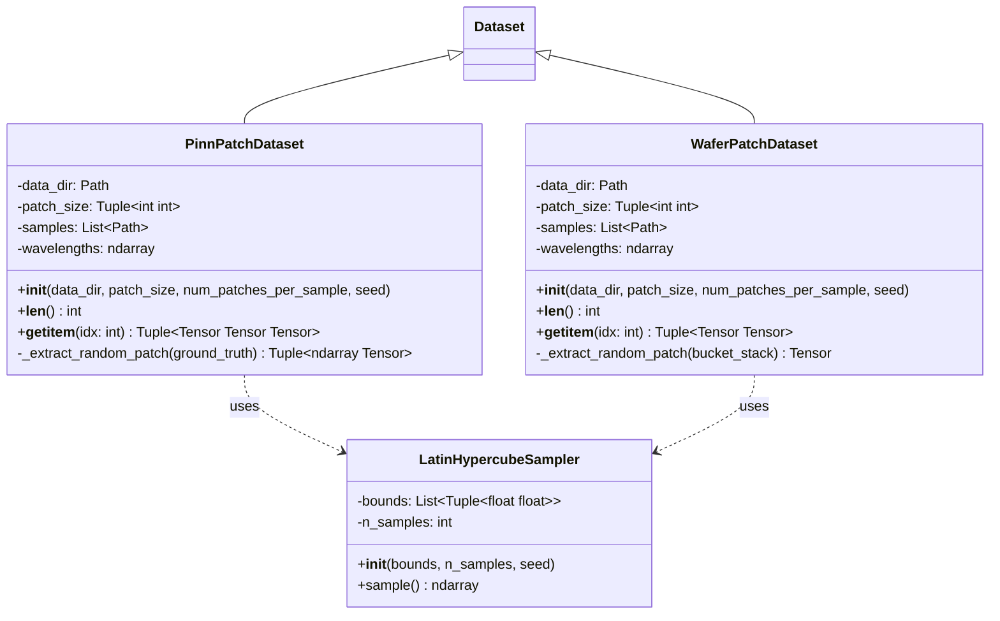
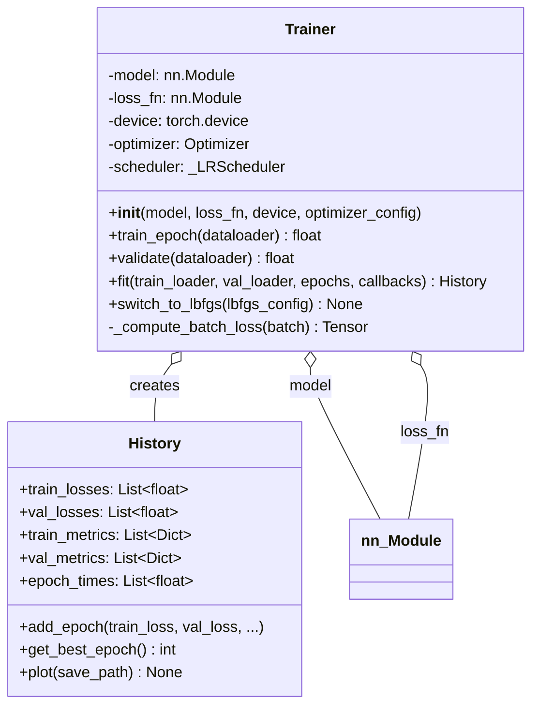
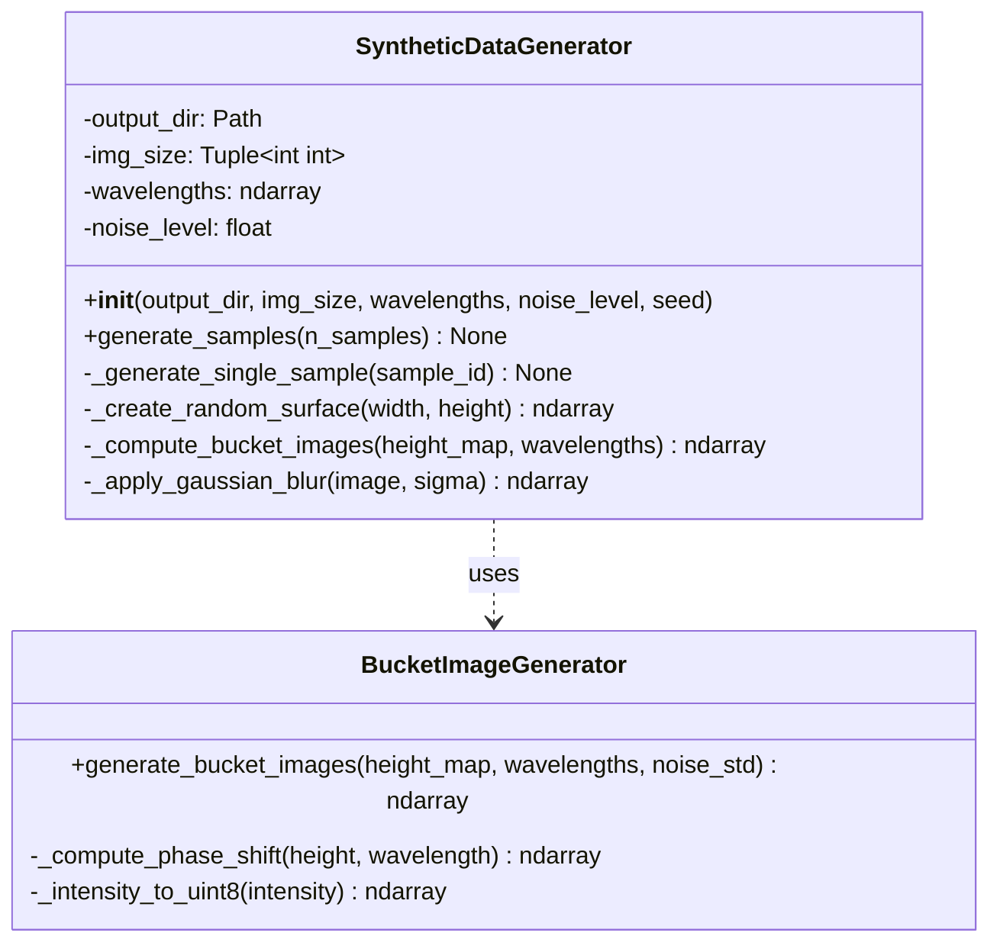
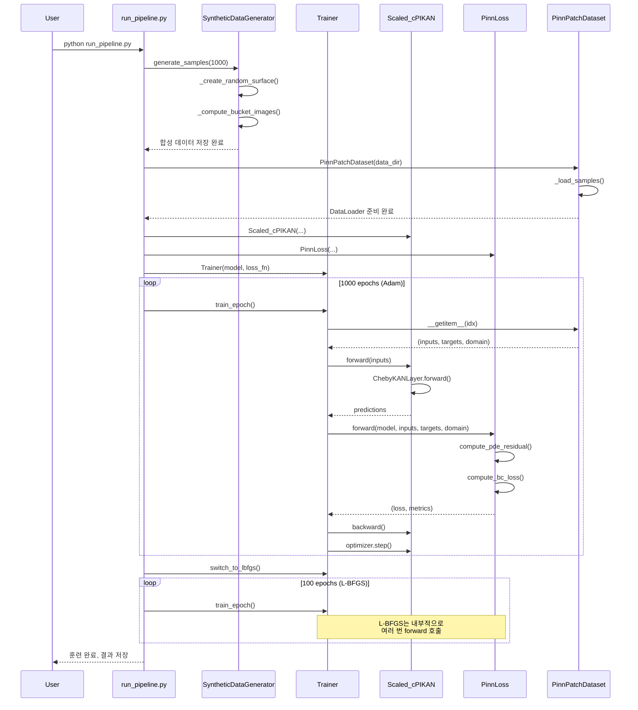
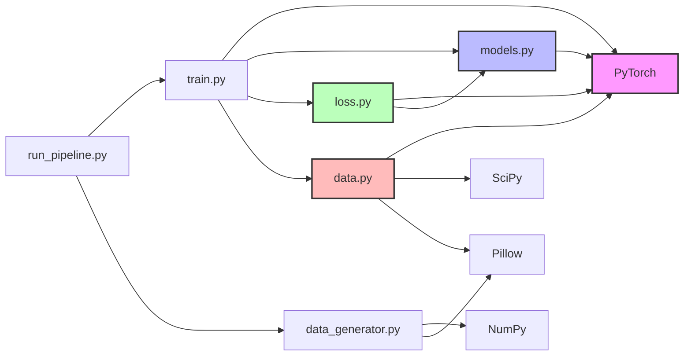

# Scaled-cPIKAN 클래스 다이어그램 및 구현 상세

**작성일**: 2025-10-25  
**버전**: 1.0  
**목적**: Scaled-cPIKAN 코드베이스의 클래스 구조, 의존성, 메서드 시그니처를 시각화하고 상세히 설명

---

## 📋 목차

1. [전체 시스템 아키텍처](#전체-시스템-아키텍처)
2. [src/models.py 클래스 다이어그램](#srcmodelspy-클래스-다이어그램)
3. [src/loss.py 클래스 다이어그램](#srclosspy-클래스-다이어그램)
4. [src/data.py 클래스 다이어그램](#srcdatapy-클래스-다이어그램)
5. [src/train.py 클래스 다이어그램](#srctrainpy-클래스-다이어그램)
6. [src/data_generator.py 클래스 다이어그램](#srcdata_generatorpy-클래스-다이어그램)
7. [클래스 간 상호작용 시퀀스 다이어그램](#클래스-간-상호작용-시퀀스-다이어그램)
8. [의존성 그래프](#의존성-그래프)
9. [설계 패턴 분석](#설계-패턴-분석)

---

## 전체 시스템 아키텍처



---

## src/models.py 클래스 다이어그램

### 클래스 계층 구조



### 클래스 상세

#### 1. ChebyKANLayer

**목적**: 체비쇼프 다항식 기저를 사용하는 Kolmogorov-Arnold Network 레이어

**이론적 배경**: 
- [Kolmogorov-Arnold Networks (KAN)](../theory/theoretical_background.md#kolmogorov-arnold-networks-kan)
- [Chebyshev 다항식 이론](../theory/theoretical_background.md#chebyshev-다항식-이론)
- [도메인 스케일링](../theory/theoretical_background.md#도메인-스케일링)

**속성**:
- `in_features: int` - 입력 차원
- `out_features: int` - 출력 차원
- `degree: int` - 체비쇼프 다항식 차수 (K)
- `coefficients: nn.Parameter` - 학습 가능한 체비쇼프 계수, 형태 `(out_features, in_features, degree+1)`
- `bounds: Tuple[float, float]` - 입력 도메인 범위 `(x_min, x_max)`

**메서드**:

```python
def forward(x: torch.Tensor) -> torch.Tensor:
    """
    Args:
        x: (batch_size, in_features) 입력 텐서
    
    Returns:
        (batch_size, out_features) 출력 텐서
    
    절차:
        1. x를 bounds를 이용해 [-1, 1]로 스케일링
        2. 체비쇼프 기저 계산: T_0(x), T_1(x), ..., T_K(x)
        3. einsum으로 계수와 곱셈: "bik,oik->bo"
    """
```

#### 2. Scaled_cPIKAN

**목적**: 여러 `ChebyKANLayer`를 쌓아 깊은 신경망 구성

**이론적 배경**: 
- [Physics-Informed Neural Networks (PINN)](../theory/theoretical_background.md#physics-informed-neural-networks-pinn)
- [Kolmogorov-Arnold Networks (KAN)](../theory/theoretical_background.md#kolmogorov-arnold-networks-kan)
- [도메인 스케일링](../theory/theoretical_background.md#도메인-스케일링)

**속성**:
- `input_dim: int` - 입력 차원 (예: 2D 문제의 경우 2)
- `hidden_dim: int` - 은닉층 차원
- `output_dim: int` - 출력 차원 (예: 스칼라 장의 경우 1)
- `depth: int` - 레이어 개수
- `degree: int` - 체비쇼프 다항식 차수
- `bounds: Tuple[Tuple[float, float], ...]` - 각 입력 차원의 도메인 범위
- `layers: nn.ModuleList` - `ChebyKANLayer` 리스트

**메서드**:
```python
def forward(x: torch.Tensor) -> torch.Tensor:
    """
    Args:
        x: (batch_size, input_dim) 입력 텐서
    
    Returns:
        (batch_size, output_dim) 출력 텐서
    
    절차:
        순차적으로 모든 레이어를 통과
    """
```

#### 3. UNet

**목적**: 사전학습을 위한 컨볼루션 신경망 (재구성 작업)

**이론적 배경**: 
- [최적화 알고리즘](../theory/theoretical_background.md#최적화-알고리즘) - Phase 1: 사전학습

**속성**:
- `in_channels: int` - 입력 채널 수 (예: 버킷 이미지 개수)
- `out_channels: int` - 출력 채널 수 (예: 높이 맵 = 1)
- `features: List[int]` - 각 레벨의 특징 맵 개수 (예: [64, 128, 256, 512])
- `encoder: nn.ModuleList` - 인코더 블록들
- `decoder: nn.ModuleList` - 디코더 블록들
- `bottleneck: nn.Sequential` - 병목 레이어

**메서드**:
```python
def forward(x: torch.Tensor) -> torch.Tensor:
    """
    Args:
        x: (batch_size, in_channels, H, W) 입력 이미지
    
    Returns:
        (batch_size, out_channels, H, W) 재구성된 출력
    
    절차:
        1. 인코더: 해상도 감소, 특징 추출
        2. 병목: 최소 해상도에서 처리
        3. 디코더: 해상도 복원, 스킵 연결 활용
    """
```

---

## src/loss.py 클래스 다이어그램



### 클래스 상세

#### 1. UnetLoss

**목적**: UNet 사전학습용 손실 함수 (재구성 + 정규화)

**이론적 배경**: 
- [최적화 알고리즘](../theory/theoretical_background.md#최적화-알고리즘) - 사전학습 단계

**속성**:
- `reconstruction_weight: float` - MSE 손실 가중치
- `smoothness_weight: float` - 스무딩 정규화 가중치

**반환값**:
```python
(loss: torch.Tensor, metrics: Dict[str, float])
```

#### 2. PinnLoss

**목적**: PINN 훈련용 물리 기반 손실 함수

**이론적 배경**: 
- [Physics-Informed Neural Networks (PINN)](../theory/theoretical_background.md#physics-informed-neural-networks-pinn)
- [PINN 손실 함수](../theory/theoretical_background.md#pinn-손실-함수)
- [자동 미분](../theory/theoretical_background.md#자동-미분)

**속성**:
- `pde_weight: float` - PDE 잔차 손실 가중치
- `bc_weight: float` - 경계 조건 손실 가중치
- `ic_weight: float` - 초기 조건 손실 가중치
- `data_weight: float` - 데이터 적합 손실 가중치
- `smoothness_weight: float` - 스무딩 정규화 가중치

#### 3. WaferReconstructionLoss

**목적**: 웨이퍼 위상 재구성을 위한 물리 기반 손실 함수

**이론적 배경**: 
- [위상 재구성 이론](../theory/theoretical_background.md#위상-재구성-이론)
- [PINN 손실 함수](../theory/theoretical_background.md#pinn-손실-함수)

**속성**:
- `pde_weight: float` - PDE 잔차 손실 가중치
- `data_weight: float` - 버킷 이미지 데이터 적합 손실 가중치
- `smoothness_weight: float` - 스무딩 정규화 가중치
- `wavelengths: ndarray` - 측정에 사용된 파장 배열

**메서드**:
```python
def forward(model, inputs, bucket_images) -> Tuple[Tensor, Dict]:
    """
    Args:
        model: Scaled_cPIKAN 모델
        inputs: (2, H, W) - 좌표 그리드
        bucket_images: (N_wavelengths, H, W) - 측정된 버킷 이미지
    
    Returns:
        (loss, metrics) - 총 손실과 세부 메트릭
    
    손실 구성:
        1. PDE 잔차: 파장별 위상-높이 관계 (h = λ * φ / (4π))
        2. 데이터 적합: 예측 버킷 이미지 vs 실제 측정값
        3. 스무딩: 표면 매끄러움 정규화
    """
```

---

## src/data.py 클래스 다이어그램



### 클래스 상세

#### 1. LatinHypercubeSampler

**목적**: 준-몬테카를로 샘플링으로 균일한 콜로케이션 포인트 생성

**이론적 배경**: 
- [Latin Hypercube Sampling](../theory/theoretical_background.md#latin-hypercube-sampling)

**사용 예시**:
```python
sampler = LatinHypercubeSampler(
    bounds=[(0, 1), (0, 1)],  # x, y 범위
    n_samples=1000
)
points = sampler.sample()  # (1000, 2) numpy array
```

#### 2. PinnPatchDataset

**목적**: 합성 훈련 데이터에서 패치를 추출하여 PINN 훈련용 데이터 제공

**이론적 배경**: 
- [Physics-Informed Neural Networks (PINN)](../theory/theoretical_background.md#physics-informed-neural-networks-pinn)
- [Latin Hypercube Sampling](../theory/theoretical_background.md#latin-hypercube-sampling)

**속성**:
- `data_dir: Path` - 데이터 디렉토리 경로
- `patch_size: Tuple[int, int]` - 패치 크기 (H, W)
- `samples: List[Path]` - 샘플 디렉토리 리스트
- `wavelengths: ndarray` - 파장 배열

**메서드**:
```python
def __getitem__(idx: int) -> Tuple[Tensor, Tensor, Tensor]:
    """
    Returns:
        inputs: (2, H, W) - 정규화된 (x, y) 좌표 그리드
        targets: (1, H, W) - ground truth 높이 맵
        domain: (N, 2) - Latin Hypercube로 샘플링된 콜로케이션 포인트
    """
```

#### 3. WaferPatchDataset

**목적**: 실제 버킷 이미지에서 패치를 추출하여 미세조정용 데이터 제공

**이론적 배경**: 
- [위상 재구성 이론](../theory/theoretical_background.md#위상-재구성-이론)
- [Latin Hypercube Sampling](../theory/theoretical_background.md#latin-hypercube-sampling)

**속성**:
- `data_dir: Path` - 데이터 디렉토리 경로
- `patch_size: Tuple[int, int]` - 패치 크기 (H, W)
- `samples: List[Path]` - 샘플 디렉토리 리스트
- `wavelengths: ndarray` - 파장 배열

**메서드**:
```python
def __getitem__(idx: int) -> Tuple[Tensor, Tensor]:
    """
    Returns:
        inputs: (2, H, W) - 정규화된 (x, y) 좌표 그리드
        bucket_images: (N_wavelengths, H, W) - 측정된 버킷 이미지
    """
```

---

## src/train.py 클래스 다이어그램



### 클래스 상세

#### 1. Trainer

**목적**: 통합 훈련 루프 (Adam + L-BFGS 지원)

**이론적 배경**: 
- [최적화 알고리즘](../theory/theoretical_background.md#최적화-알고리즘) - 2단계 최적화 전략

**사용 예시**:
```python
trainer = Trainer(
    model=scaled_cpikan,
    loss_fn=pinn_loss,
    device='cuda',
    optimizer_config={
        'type': 'adam',
        'lr': 1e-3,
        'betas': (0.9, 0.999)
    }
)

# Phase 1: Adam
history1 = trainer.fit(train_loader, val_loader, epochs=1000)

# Phase 2: L-BFGS
trainer.switch_to_lbfgs({'lr': 1.0, 'max_iter': 20})
history2 = trainer.fit(train_loader, val_loader, epochs=100)
```

#### 2. History

**목적**: 훈련 과정의 메트릭 기록 및 시각화

**속성**:
- `train_losses: List[float]` - 에포크별 훈련 손실
- `val_losses: List[float]` - 에포크별 검증 손실
- `train_metrics: List[Dict]` - 에포크별 훈련 메트릭 (PDE 잔차, BC 손실 등)
- `val_metrics: List[Dict]` - 에포크별 검증 메트릭
- `epoch_times: List[float]` - 에포크별 소요 시간

**메서드**:
```python
def add_epoch(train_loss, val_loss, train_metrics, val_metrics, epoch_time):
    """에포크 결과를 히스토리에 추가"""

def get_best_epoch() -> int:
    """검증 손실이 가장 낮았던 에포크 번호 반환"""

def plot(save_path: str) -> None:
    """손실 곡선과 메트릭을 matplotlib으로 시각화"""
```

---

## src/data_generator.py 클래스 다이어그램



### 클래스 상세

#### 1. SyntheticDataGenerator

**목적**: PINN 사전학습을 위한 합성 훈련 데이터 생성

**이론적 배경**: 
- [위상 재구성 이론](../theory/theoretical_background.md#위상-재구성-이론)

**속성**:
- `output_dir: Path` - 생성된 데이터 저장 경로
- `img_size: Tuple[int, int]` - 이미지 크기 (H, W)
- `wavelengths: ndarray` - 시뮬레이션에 사용할 파장 배열
- `noise_level: float` - 가우시안 노이즈 표준편차
- `seed: int` - 랜덤 시드

**메서드**:
```python
def generate_samples(n_samples: int) -> None:
    """
    Args:
        n_samples: 생성할 샘플 개수
    
    절차:
        1. _create_random_surface: 무작위 높이 맵 생성 (Perlin noise 등)
        2. _compute_bucket_images: 높이 → 위상 → 강도 변환
        3. _apply_gaussian_blur: 현실적인 노이즈 추가
        4. 저장: sample_xxx/ground_truth.npy, bucket_*.bmp
    """
```

#### 2. BucketImageGenerator

**목적**: 높이 맵에서 버킷 이미지를 생성하는 물리 시뮬레이터

**이론적 배경**: 
- [위상 재구성 이론](../theory/theoretical_background.md#위상-재구성-이론)

**메서드**:
```python
def generate_bucket_images(height_map, wavelengths, noise_std) -> ndarray:
    """
    물리 기반 버킷 이미지 생성
    
    공식:
        φ(x, y) = 4π * h(x, y) / λ  (위상)
        I(x, y) = I_0 * (1 + cos(φ))  (간섭 강도)
    
    Returns:
        (N_wavelengths, H, W) - 버킷 이미지 배열
    """
```

---

## 클래스 간 상호작용 시퀀스 다이어그램

### 시나리오 1: 전체 파이프라인 실행



---

## 의존성 그래프



---

## 설계 패턴 분석

### 1. 전략 패턴 (Strategy Pattern)

**적용 위치**: `Trainer` 클래스의 옵티마이저 전환

```python
class Trainer:
    def __init__(self, ..., optimizer_config):
        if optimizer_config['type'] == 'adam':
            self.optimizer = torch.optim.Adam(...)
        elif optimizer_config['type'] == 'lbfgs':
            self.optimizer = torch.optim.LBFGS(...)
    
    def switch_to_lbfgs(self, config):
        # 런타임에 전략 교체
        self.optimizer = torch.optim.LBFGS(self.model.parameters(), **config)
```

**장점**: 훈련 중간에 최적화 알고리즘 변경 가능

### 2. 템플릿 메서드 패턴 (Template Method Pattern)

**적용 위치**: 손실 함수 클래스들 (`UnetLoss`, `PinnLoss`, `WaferReconstructionLoss`)

```python
class BaseLoss(nn.Module):
    def forward(self, *args, **kwargs):
        # 템플릿 메서드
        loss = 0.0
        metrics = {}
        
        # 각 서브클래스가 구현
        loss += self.compute_main_loss(*args)
        loss += self.compute_regularization(*args)
        
        return loss, metrics
```

### 3. 팩토리 패턴 (Factory Pattern)

**적용 위치**: 데이터셋 생성

```python
def create_dataset(config):
    if config['type'] == 'pinn':
        return PinnPatchDataset(...)
    elif config['type'] == 'wafer':
        return WaferPatchDataset(...)
```

### 4. 옵저버 패턴 (Observer Pattern)

**적용 위치**: `History` 클래스

```python
class History:
    def add_epoch(self, train_loss, val_loss, ...):
        # 훈련 진행 상황 기록
        self.train_losses.append(train_loss)
        # 필요 시 콜백 호출
        for callback in self.callbacks:
            callback.on_epoch_end(...)
```

---

## 핵심 데이터 흐름

### 입력 → 모델 → 손실 → 역전파

```
입력 데이터 (batch_size, input_dim)
    ↓
[Scaled_cPIKAN]
    ↓ ChebyKANLayer 1: (input_dim) → (hidden_dim)
    ↓ ChebyKANLayer 2: (hidden_dim) → (hidden_dim)
    ↓ ...
    ↓ ChebyKANLayer N: (hidden_dim) → (output_dim)
    ↓
예측값 (batch_size, output_dim)
    ↓
[PinnLoss]
    ↓ PDE 잔차 계산 (torch.autograd.grad)
    ↓ BC 손실 계산
    ↓ 데이터 적합 손실
    ↓
총 손실 (스칼라)
    ↓
[Optimizer]
    ↓ backward()
    ↓ step()
    ↓
파라미터 업데이트 (coefficients)
```

---

## 클래스별 책임 요약

| 클래스 | 책임 | 주요 메서드 | 의존성 |
|--------|------|-------------|--------|
| `ChebyKANLayer` | 체비쇼프 다항식 기반 레이어 | `forward`, `_chebyshev_basis` | PyTorch |
| `Scaled_cPIKAN` | 전체 PINN 네트워크 | `forward` | `ChebyKANLayer` |
| `UNet` | 사전학습용 UNet | `forward` | PyTorch |
| `PinnLoss` | 물리 기반 손실 계산 | `compute_pde_residual`, `compute_bc_loss` | `torch.autograd` |
| `PinnPatchDataset` | 훈련 데이터 로딩 | `__getitem__`, `_extract_random_patch` | `LatinHypercubeSampler` |
| `Trainer` | 훈련 루프 관리 | `fit`, `train_epoch`, `switch_to_lbfgs` | 모든 모듈 |
| `SyntheticDataGenerator` | 합성 데이터 생성 | `generate_samples`, `_compute_bucket_images` | NumPy, Pillow |

---

## 확장 가이드

### 새로운 모델 추가

1. `src/models.py`에 `nn.Module` 상속 클래스 추가
2. `forward` 메서드 구현
3. `examples/` 폴더에 데모 스크립트 추가

```python
class NewModel(nn.Module):
    def __init__(self, ...):
        super().__init__()
        # 레이어 초기화
    
    def forward(self, x):
        # 정방향 계산
        return output
```

### 새로운 손실 함수 추가

1. `src/loss.py`에 `nn.Module` 상속 클래스 추가
2. `forward` 메서드에서 `(loss, metrics)` 반환

```python
class NewLoss(nn.Module):
    def forward(self, model, inputs, targets):
        # 손실 계산
        loss = ...
        metrics = {'loss_component1': ..., 'loss_component2': ...}
        return loss, metrics
```

---

**문서 버전**: 1.0  
**최종 업데이트**: 2025-10-25  
**작성자**: Scaled-cPIKAN 개발팀  
**관련 문서**: [이론적 배경](../theory/theoretical_background.md)
